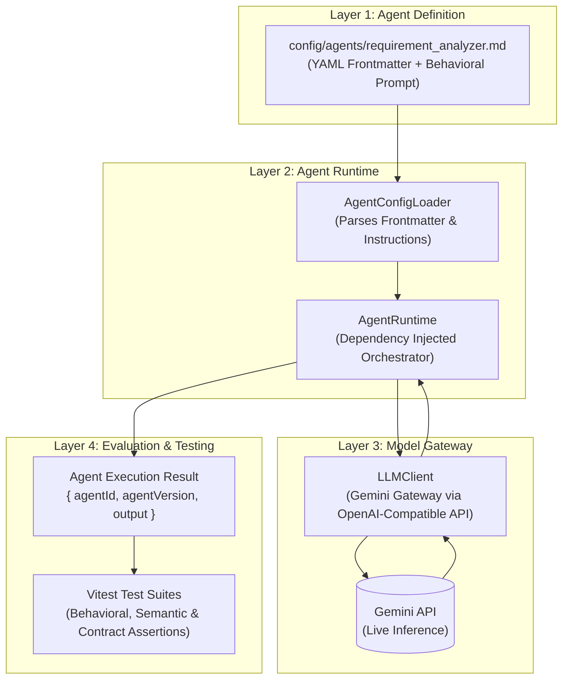

# Agent Testing & Quality Engineering (QE) Platform

A configuration-driven AI agent platform built from first principles to test, evaluate, and benchmark AI agent behavior.

Rather than treating Large Language Models as black-box chatbots or testing single hard-coded API calls, this platform provides an architectural foundation for **Agent Quality Engineering (Agent QE)**: evaluating behavioral contracts, runtime orchestration, semantic outputs, negative boundaries, ambiguity handling, grounding guardrails, and regressions.

---

## 🏛️ The 4-Layer Architecture

The platform strictly decouples agent definitions, execution runtime, model providers, and test evaluation:



### Layer Breakdown

1. **Layer 1 — Agent Definition (`config/agents/*.md`)**  
   The behavioral contract of the agent written in Markdown with YAML frontmatter. Defines identity (`agentId`, `version`), target model parameters (`model`, `temperature: 0`), operational role, negative rules, and output format.
2. **Layer 2 — Agent Runtime (`src/runtime/`, `src/config/`)**  
   TypeScript execution engine. Completely agnostic to the agent's domain logic. Loads configs, prepares execution context, propagates configuration parameters (including `temperature`), calls the injected LLM gateway, and wraps output into typed `AgentResult` execution payloads.
3. **Layer 3 — Model Gateway (`src/llm/LLMClient.ts`)**  
   LLM gateway that currently connects to Google Gemini through its OpenAI-compatible API. The runtime depends on the gateway rather than directly depending on a model provider, allowing provider abstraction to evolve independently.
4. **Layer 4 — Evaluation & Testing (`tests/`)**  
   Automated Quality Engineering test suites evaluating agent behaviors against contracts across diverse input distributions.

---

## 🎯 Stage 1 — Requirement Analyzer Agent

The first agent built and evaluated on this platform is the **Requirement Analyzer Agent**.

### Input
A software requirement text string. Example:
> *"The user should be able to reset their password using their registered email address."*

### Contract Responsibilities
The agent is tasked to extract:
* **Actor**: The entity performing the action.
* **Feature**: The core software functionality.
* **Preconditions**: States that must be true prior to execution.
* **Positive Scenarios**: Happy path behaviors.
* **Negative Scenarios**: Failure and boundary conditions.
* **Ambiguities**: Underspecified logic, missing requirements, or multiple interpretations.

### Expected Output Schema (Contract)
The agent is instructed to format its output according to this JSON structure:
```json
{
  "actor": "string",
  "feature": "string",
  "preconditions": [],
  "positiveScenarios": [],
  "negativeScenarios": [],
  "ambiguities": []
}
```

---

## 🧪 Agent QE Philosophy: Behavioral vs. String Testing

In traditional software testing, tests assert deterministic equality:
```typescript
expect(output).toBe("Login successful"); // Deterministic equality
```

For AI agents, natural-language model outputs may vary in wording even when the underlying behavior is equivalent, making exact string matching brittle for many AI-agent tests:
* The model might say `"User"` in one run and `"user"` in another.
* It might say `"Password reset"` in run 1 and `"Resetting user password"` in run 2.
* Both are functionally correct. Exact string equality produces false alarms and test flakiness.

### How this Platform Evaluates Agents
1. **Contract Validity**: Verifying that the output conforms to valid JSON matching the expected keys.
2. **Semantic Verification**: Testing whether the model understood the actor, feature, and intent (e.g. `expect(parsed.actor.toLowerCase()).toContain("user")`).
3. **Grounding & Scope Guardrails**: Ensuring the agent uses only provided facts and does not invent business rules, databases, or systems out of thin air.
4. **Preserving Uncertainty**: Verifying that when information is missing, ambiguous, or contradictory, the agent explicitly flags it rather than guessing.

---

## 📂 Test Matrix

The test suite is organized into distinct categories under `tests/requirement-analyzer/`:

| Test Case | Category | File | What it Validates |
| :--- | :--- | :--- | :--- |
| **TC001** | Functional | `functional-testing/functional.test.ts` | Schema and semantic understanding of a valid password reset requirement. |
| **TC002** | Negative / Robustness | `negative-testing/negative.test.ts` | Empty input (`""`) and graceful degradation acknowledging missing information. |
| **TC003** | Scope / Hallucination | `negative-testing/scope.test.ts` | Unrelated input (*"Bananas and elephants"*); prevents inventing software features. |
| **TC004** | Nonsense Input | `negative-testing/nonsense.test.ts` | Meaningless gibberish input; ensures agent safely acknowledges lack of requirement. |
| **TC005** | Ambiguity | `ambiguity-testing/ambiguity.test.ts` | Identifies subjective/underspecified language (*"quickly"*). |
| **TC006** | True Ambiguity | `ambiguity-testing/true-ambiguity.test.ts` | Preserves multiple valid interpretations (*"within one day"* - 24 hours vs calendar day). |
| **TC007** | Grounding | `grounding-testing/grounding.test.ts` | Preserves unknowns when evidence is sparse (*"upload a profile picture"*). |
| **TC008** | Grounding | `grounding-testing/explicit-details.test.ts` | Uses explicit technical evidence (*"Amazon S3"*) without losing it or inventing extras. |
| **TC009** | Grounding | `grounding-testing/contradictory-evidence.test.ts` | Detects and surfaces conflicting requirements (e.g. local device storage vs cloud S3). |
| **TC010** | Grounding | `grounding-testing/unsupported-inference.test.ts` | Prevents presenting reasonable assumptions as established facts. |

---

## 🧭 The Learning Journey

This repository tracks a progressive curriculum in Agent Quality Engineering:

```
Requirement Analysis
        ↓
Functional Correctness
        ↓
Negative Boundaries
        ↓
Ambiguity & Uncertainty
        ↓
Grounding & Evidence
        ↓
From Reasoning to Acting
        ↓
Tool-Calling Agents
        ↓
Guardrails & Failure Containment
        ↓
Multi-Agent Contracts
        ↓
Evaluation & Regression
        ↓
Production Agent QE & Governance
```

### Architectural Evolution

```text
                CURRENT ARCHITECTURE
Agent Definition ──► Agent Runtime ──► Model Gateway ──► Agent Execution Result ──► Behavioral Tests

                 NEXT EVOLUTION
Agent ──► Decision ──► Tool Execution Loop ──► Observation ──► Agent ──► Decision ──► Output
```

---

## 📁 Project Structure

```
agent-testing-training/
├── config/
│   └── agents/
│       └── requirement_analyzer.md       # Layer 1: Agent behavioral contract & prompt
├── src/
│   ├── config/
│   │   └── AgentConfigLoader.ts          # Markdown frontmatter parser (gray-matter)
│   ├── llm/
│   │   └── LLMClient.ts                  # Layer 3: Model gateway (Gemini API via OpenAI SDK)
│   ├── runtime/
│   │   └── AgentRuntime.ts               # Layer 2: Dependency-injected runtime orchestrator
│   ├── types/
│   │   └── AgentTypes.ts                 # Strongly typed data contracts
│   └── index.ts                          # Manual execution entry point
├── tests/
│   └── requirement-analyzer/
│       ├── functional-testing/           # Core functional requirement tests (TC001)
│       │   └── functional.test.ts
│       ├── negative-testing/             # Empty, scope, and nonsense tests (TC002-TC004)
│       │   ├── negative.test.ts
│       │   ├── nonsense.test.ts
│       │   └── scope.test.ts
│       ├── ambiguity-testing/            # Ambiguity and uncertainty tests (TC005-TC006)
│       │   ├── ambiguity.test.ts
│       │   └── true-ambiguity.test.ts
│       └── grounding-testing/            # Grounding and evidence tests (TC007-TC010)
│           ├── grounding.test.ts
│           ├── explicit-details.test.ts
│           ├── contradictory-evidence.test.ts
│           └── unsupported-inference.test.ts
├── package.json
├── tsconfig.json                         # TypeScript compiler configuration & path aliases (@src/*)
└── vitest.config.ts                      # Test runner settings (timeouts & sequential execution for APIs)
```

---

## 🚀 Getting Started

### Prerequisites
* **Node.js**: v20+ recommended
* **npm**: v10+
* **Gemini API Key**: A free key from [Google AI Studio](https://aistudio.google.com/apikey)

### Installation

1. **Clone the repository**:
   ```bash
   git clone https://github.com/rajeshyemul/agent-testing-training.git
   cd agent-testing-training
   ```

2. **Install dependencies**:
   ```bash
   npm install
   ```

3. **Configure environment variables**:
   Create a `.env` file in the root directory:
   ```bash
   GEMINI_API_KEY=your_google_ai_studio_api_key_here
   ```

---

## 💻 Running the Project

### 1. Manual Agent Execution
Run the standalone execution of the Requirement Analyzer Agent:
```bash
npm run agent
```

### 2. Run the Automated Test Suites
Run all Vitest test suites sequentially:
```bash
npm test
```

Run a specific test category or file:
```bash
npm test -- functional.test.ts
npm test -- ambiguity.test.ts
npm test -- grounding.test.ts
npm test -- scope.test.ts
```

Run in interactive watch mode during development:
```bash
npm run test:watch
```

### 3. Build / Type Check
Verify TypeScript compilation and type definitions:
```bash
npm run build
```

---

## 🗺️ Learning & Implementation Roadmap

### Foundation
- [x] **Stage 1 — Configuration-Driven Agent Runtime**
- [x] **Stage 2 — Requirement Analyzer Agent Contract**
- [x] **Stage 3 — Functional Testing**
- [x] **Stage 3.5 — The AI Test Oracle**
- [x] **Stage 4 — Reasoning and Ambiguity Testing**

### Agent Behavior & Grounding
- [x] **Stage 7 — Grounding, Hallucination & Evidence (TC007–TC010)**
- [ ] **Stage 4.5 — From Reasoning to Acting**
- [ ] **Stage 5 — Tool-Calling Agents & Action Loops**
- [ ] **Stage 6 — Boundaries, Guardrails & Failure Containment**

### Agent Systems & Governance
- [ ] **Stage 8 — Multi-Agent Testing & Agent Contracts**
- [ ] **Stage 9 — Evaluation & Regression Testing**
- [ ] **Stage 10 — Production Agent QE & CI/CD Quality Gates**
